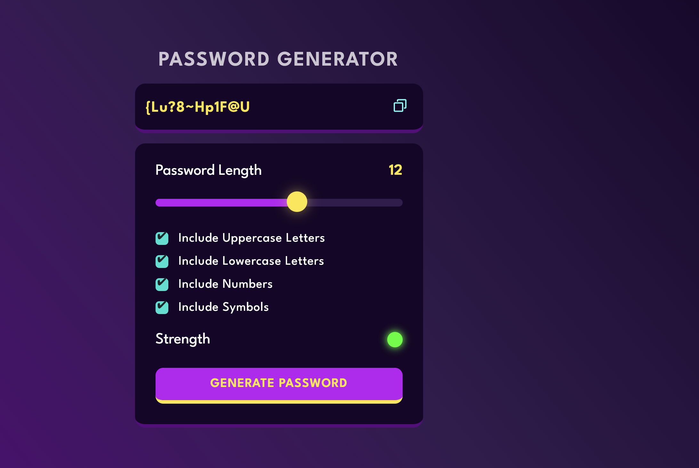

# 🔐 Password Generator

A simple and customizable Password Generator built with **HTML**, **CSS**, and **JavaScript**. This web app allows users to create strong, secure passwords based on selected preferences like length, uppercase, lowercase, numbers, and special characters.

## 🌟 Features

- Generate strong random passwords
- Options to include:
  - ✅ Uppercase letters (A–Z)
  - ✅ Lowercase letters (a–z)
  - ✅ Numbers (0–9)
  - ✅ Symbols (@, #, $, etc.)
- Copy generated password to clipboard
- Simple, responsive UI

## 🖥️ Live Demo


👉 [Click here to try it out](https://anshul0k.github.io/Password-Generator/) 

## 📸 Preview



## 🛠️ Built With

- HTML5
- CSS3
- Vanilla JavaScript

## 🚀 Getting Started

Clone the repository:
```bash
git clone https://github.com/your-username/repo-name.git
